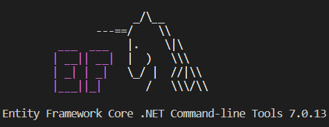

# Database
### This project is using EntityFramework Core Version 7.0.13

* You need to check your EF Core is installed
`dotnet ef`

* First needs to add migration
`dotnet ef migrations add InitialCreate --project .\pet_store_backend.infrastructure\ --startup-project .\pet_store_backend.api\` `

* Second you need to update your connection string
Example: My ConnectionString is "Data Source=.;Initial Catalog=PetStore;Trusted_Connection=True;Encrypt=false"
`dotnet ef database update -p .\pet_store_backend.infrastructure\ -s .\pet_store_backend.api\ --connection "Data Source=.;Initial Catalog=PetStore;Trusted_Connection=True;Encrypt=false"`
* Remove Exist Migration 
`dotnet ef migrations remove -p .\pet_store_backend.infrastructure\ -s .\pet_store_backend.api\`
* Update your model in EF Core

## That's all you need !